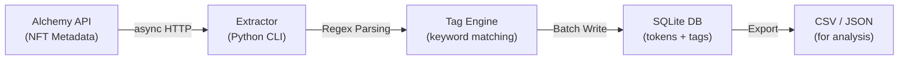
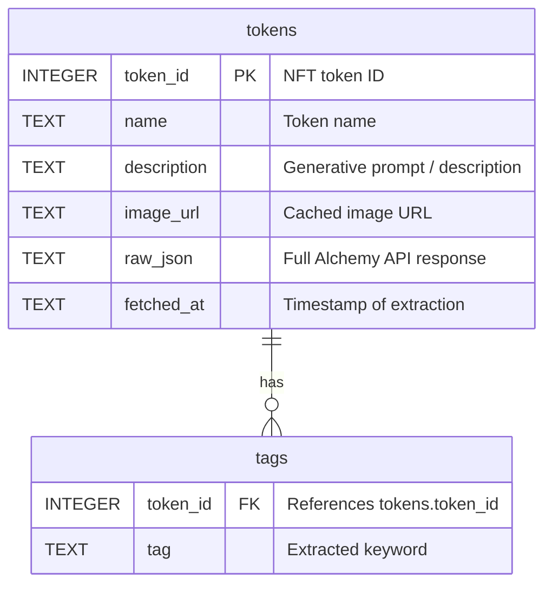
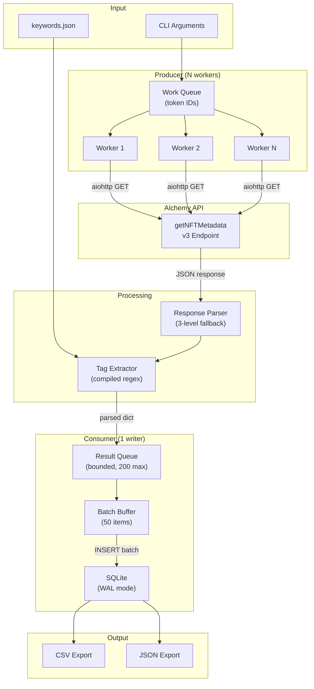
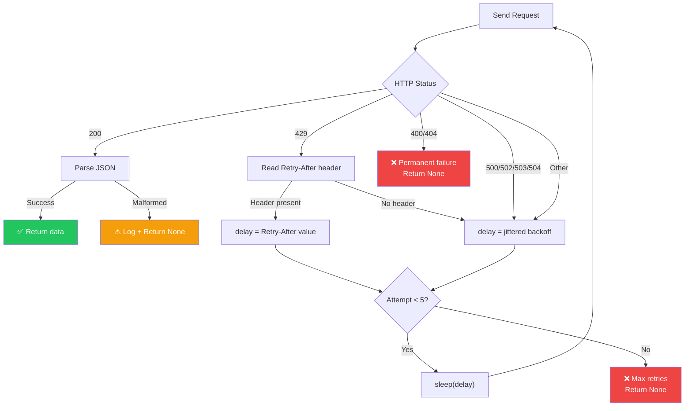

# Botto NFT Metadata Extractor

### Documentation & Usage Tutorial

---

## Table of Contents

1. [Project Overview](#1-project-overview)
2. [Prerequisites](#2-prerequisites)
3. [Installation](#3-installation)
4. [Quick Start](#4-quick-start)
5. [CLI Reference](#5-cli-reference)
6. [Usage Tutorial](#6-usage-tutorial)
7. [Automated Orchestrator Daemon](#7-automated-orchestrator-daemon)
8. [Keyword Customization](#8-keyword-customization)
9. [Working with the Database](#9-working-with-the-database)
10. [Exporting Data](#10-exporting-data)
11. [Configuration & Tuning](#11-configuration--tuning)
12. [Architecture Deep Dive](#12-architecture-deep-dive)
13. [Troubleshooting](#13-troubleshooting)
14. [FAQ](#14-faq)

---

## 1. Project Overview

The **Botto NFT Metadata Extractor** is an asynchronous Python CLI tool that retrieves NFT metadata from the [Alchemy API](https://docs.alchemy.com/reference/getnftmetadata), parses generative AI prompts from token descriptions using Regex, and stores structured results in a local SQLite database.

It was purpose-built for analyzing the **Botto AI art project** — an autonomous AI artist whose token descriptions contain the generative prompts used to create each artwork. By extracting and tagging these prompts with aesthetic and visual keywords, researchers can study how Botto's artistic style evolves over time.

### What It Does



1. **Fetches** metadata for a range of token IDs from a smart contract via the Alchemy NFT API v3
2. **Parses** the `description` field to extract aesthetic/visual keywords (e.g., *"chiaroscuro"*, *"cyberpunk"*, *"9:16"*)
3. **Stores** the raw metadata, parsed descriptions, and extracted tags in a normalized SQLite database
4. **Exports** results to CSV or JSON for use in notebooks, dashboards, or further analysis

### Key Features

| Feature | Description |
|---|---|
| **Async I/O** | Concurrent HTTP requests via `aiohttp` — extracts thousands of tokens in minutes, not hours |
| **Resilient Networking** | Jittered exponential backoff, `Retry-After` header support, timeout protection |
| **Idempotent Resume** | Safely re-run after crashes — already-fetched tokens are skipped automatically |
| **Normalized Storage** | Two-table SQLite schema (tokens + tags) with indexes for fast analytical queries |
| **Raw Data Preservation** | Full API responses stored as JSON — re-parse without re-fetching |
| **Graceful Shutdown** | Ctrl+C flushes in-flight data to disk — zero data loss |
| **Configurable Keywords** | External `keywords.json` file — iterate on taxonomy without touching code |

### Project Structure

```
botto-extractor/
├── extractor.py          # Main CLI script (all logic in one file)
├── keywords.json         # Aesthetic keyword taxonomy (editable)
├── requirements.txt      # Python dependencies
├── .gitignore            # Excludes generated .db, .csv files
└── README.md             # Quick-start instructions
```

---

## 2. Prerequisites

| Requirement | Minimum Version | How to Check |
|---|---|---|
| **Python** | 3.11+ | `python --version` |
| **pip** | Any recent | `pip --version` |
| **Alchemy API Key** | Free tier works | [Sign up at alchemy.com](https://www.alchemy.com/) |

> [!NOTE]
> The tool uses only the `getNFTMetadata` endpoint, which is available on Alchemy's **free tier** (no credit card required). The free tier provides approximately 330 compute units per second, which is sufficient for this tool's default concurrency of 15.

### Getting an Alchemy API Key

1. Go to [dashboard.alchemy.com](https://dashboard.alchemy.com/) and create an account
2. Click **"Create new app"**
3. Select **Ethereum Mainnet** as the network
4. Copy the **API Key** from your app's dashboard (not the full URL — just the key)

---

## 3. Installation

### Step 1: Clone the Repository

```bash
git clone https://github.com/AKSANMusic/BOt0.git
cd BOt0
```

### Step 2: (Recommended) Create a Virtual Environment

```bash
# Create
python -m venv venv

# Activate (Windows)
venv\Scripts\activate

# Activate (macOS/Linux)
source venv/bin/activate
```

### Step 3: Install Dependencies

```bash
pip install -r requirements.txt
```

This installs:
- **`aiohttp`** (≥3.9, <4) — Async HTTP client for API requests
- **`aiosqlite`** (≥0.20, <1) — Async wrapper for SQLite

> [!TIP]
> All other imports (`argparse`, `asyncio`, `json`, `re`, `csv`, `logging`, `signal`) are from the Python standard library — no additional installation needed.

### Verify Installation

```bash
python extractor.py --help
```

Expected output:
```
usage: extractor.py [-h] --contract CONTRACT --start START --end END
                    --api-key API_KEY [--network NETWORK]
                    [--concurrency CONCURRENCY]
                    [--keywords-file KEYWORDS_FILE]
                    [--export {csv,json}] [-v]

Extract NFT metadata and parse visual tags.
```

---

## 4. Quick Start

Extract the first 100 Botto tokens and export to CSV in one command:

```bash
python extractor.py \
  --contract 0xF5e0E37862fB3FdBbE83a4374B22e5704f7aD4E8 \
  --start 1 \
  --end 100 \
  --api-key YOUR_ALCHEMY_API_KEY \
  --export csv
```

This will:
1. Create `0xF5e0E37862fB3FdBbE83a4374B22e5704f7aD4E8_nft.db` (SQLite database)
2. Fetch metadata for tokens 1–100
3. Parse descriptions and extract aesthetic tags
4. Export to `0xF5e0E37862fB3FdBbE83a4374B22e5704f7aD4E8_export.csv`

---

## 5. CLI Reference

### Arguments

| Argument | Type | Required | Default | Description |
|---|---|---|---|---|
| `--contract` | string | ✅ | — | The smart contract address. Must be a valid 42-character hex address starting with `0x`. |
| `--start` | integer | ✅ | — | First token ID to fetch (inclusive). |
| `--end` | integer | ✅ | — | Last token ID to fetch (inclusive). Must be ≥ `--start`. |
| `--api-key` | string | ✅ | — | Your Alchemy API key. |
| `--network` | string | ❌ | `eth-mainnet` | Alchemy network identifier (e.g., `eth-mainnet`, `eth-goerli`, `polygon-mainnet`). |
| `--concurrency` | integer | ❌ | `15` | Maximum number of concurrent API requests. |
| `--keywords-file` | string | ❌ | `keywords.json` | Path to the keyword taxonomy JSON file. |
| `--export` | string | ❌ | — | Export format after extraction. Choices: `csv`, `json`. |
| `-v`, `--verbose` | flag | ❌ | off | Enable debug-level logging for detailed output. |

### Validation Rules

The tool validates all arguments before making any API calls:

- `--contract` must start with `0x`, be exactly 42 characters, and contain only valid hexadecimal characters
- `--start` must be ≤ `--end`
- `--keywords-file` must point to an existing file

Invalid arguments will produce a clear error message and exit immediately.

---

## 6. Usage Tutorial

### 6.1 Basic Extraction

Extract metadata for tokens 1 through 500:

```bash
python extractor.py \
  --contract 0xF5e0E37862fB3FdBbE83a4374B22e5704f7aD4E8 \
  --start 1 \
  --end 500 \
  --api-key YOUR_KEY
```

**Expected output:**
```
[2026-08-25 23:00:01] INFO | Starting extraction: 500/500 tokens to fetch (0 cached)
[2026-08-25 23:00:15] INFO | Flushed 50 tokens to database
[2026-08-25 23:00:18] INFO | Progress: 100/500 (20.0%) | Errors: 0 | Retries: 0
[2026-08-25 23:00:29] INFO | Flushed 50 tokens to database
...
[2026-08-25 23:01:02] INFO | Extraction complete.
[2026-08-25 23:01:02] INFO | Stats: Fetched=487, Skipped=13, Errors=0, Retries=0
```

**What the stats mean:**
- **Fetched**: Tokens successfully retrieved from the API
- **Skipped**: Tokens with empty or missing descriptions (not stored)
- **Errors**: Permanent failures (404s, malformed responses, max retries exceeded)
- **Retries**: Total retry attempts across all tokens (429s, 5xx errors)

### 6.2 Resuming an Interrupted Run

If the extraction is interrupted (Ctrl+C, network outage, laptop sleep), simply **re-run the exact same command**:

```bash
# First run — interrupted at token 300
python extractor.py \
  --contract 0xF5e0E37862fB3FdBbE83a4374B22e5704f7aD4E8 \
  --start 1 --end 500 --api-key YOUR_KEY
# ^C pressed

# Second run — resumes from where it stopped
python extractor.py \
  --contract 0xF5e0E37862fB3FdBbE83a4374B22e5704f7aD4E8 \
  --start 1 --end 500 --api-key YOUR_KEY
```

**Output on resume:**
```
[2026-08-25 23:05:00] INFO | Starting extraction: 200/500 tokens to fetch (300 cached)
```

The tool checks the database for existing token IDs and **only fetches what's missing**.

### 6.3 Custom Concurrency

For large extractions (thousands of tokens), you can increase or decrease concurrency:

```bash
# Faster extraction (higher API usage)
python extractor.py \
  --contract 0xF5e0E37862fB3FdBbE83a4374B22e5704f7aD4E8 \
  --start 1 --end 6000 \
  --api-key YOUR_KEY \
  --concurrency 25

# Gentler on the API (lower risk of rate limiting)
python extractor.py \
  --contract 0xF5e0E37862fB3FdBbE83a4374B22e5704f7aD4E8 \
  --start 1 --end 6000 \
  --api-key YOUR_KEY \
  --concurrency 5
```

> [!TIP]
> **Recommended values:**
> - Free tier: `10–15` (default)
> - Growth tier: `20–30`
> - If you're seeing many retries in the logs, lower the concurrency

### 6.4 Verbose / Debug Mode

For detailed logging (every request, retry, and skip):

```bash
python extractor.py \
  --contract 0xF5e0E37862fB3FdBbE83a4374B22e5704f7aD4E8 \
  --start 1 --end 10 \
  --api-key YOUR_KEY \
  --verbose
```

### 6.5 Using a Different Network

The tool defaults to Ethereum Mainnet, but you can target any Alchemy-supported network:

```bash
# Polygon
python extractor.py \
  --contract 0x... \
  --start 1 --end 100 \
  --api-key YOUR_KEY \
  --network polygon-mainnet

# Arbitrum
python extractor.py \
  --contract 0x... \
  --start 1 --end 100 \
  --api-key YOUR_KEY \
  --network arb-mainnet
```

---

## 7. Automated Orchestrator Daemon

The `orchestrator.py` script transforms the metadata extractor into a fully automated, continuous background daemon.

Instead of manually providing a contract address to `extractor.py`, the Orchestrator continuously polls the Etherscan API for transactions generated by a specific "Deployer" wallet address. When it detects that the deployer has created a new smart contract, it automatically discovers it, registers it in a lightweight tracking database (`orchestrator.db`), and programmatically triggers the `extractor.py` pipeline.

### Running the Orchestrator

```bash
python orchestrator.py \
  --deployer 0xYourDeployerWalletAddress \
  --etherscan-key YOUR_ETHERSCAN_API_KEY \
  --alchemy-key YOUR_ALCHEMY_API_KEY \
  --poll-interval 60 \
  --concurrency 15 \
  --start-id 1 \
  --end-id 6000
```

### Orchestrator Arguments

| Argument | Type | Required | Default | Description |
|---|---|---|---|---|
| `--deployer` | string | ✅ | — | The wallet address responsible for deploying the Botto NFT contracts. |
| `--etherscan-key` | string | ✅ | — | Your Etherscan API key (used for discovery). |
| `--alchemy-key` | string | ✅ | — | Your Alchemy API key (passed to the extractor). |
| `--poll-interval` | integer | ❌ | `60` | Wait time (in seconds) between discovery sweeps. |
| `--start-block` | integer | ❌ | `0` | Block number to start discovery from (saves API limits). |
| `--concurrency` | integer | ❌ | `15` | API concurrency level (passed to the extractor). |
| `--start-id` | integer | ❌ | `1` | First token ID to fetch (passed to the extractor). |
| `--end-id` | integer | ❌ | `6000` | Last token ID to fetch (passed to the extractor). |

### State Management (`orchestrator.db`)

The daemon ensures **exactly-once processing** by storing discovered contracts in an SQLite database.
You can query this database to check the status of your fleet:

```bash
sqlite3 orchestrator.db "SELECT address, status, discovered_at FROM contracts;"
```

Valid statuses are: `pending`, `processing`, `completed`, and `failed`.

---

## 8. Keyword Customization

### The Keyword File

The tool extracts visual/aesthetic tags by matching token descriptions against a configurable list of keywords stored in `keywords.json`:

```json
{
  "keywords": [
    "chiaroscuro", "monochrome", "cyberpunk", "surrealism",
    "oil painting", "digital art", "dramatic lighting",
    "9:16", "16:9", "1:1",
    ...
  ]
}
```

### How Matching Works

The tool uses **regex with word boundaries** and **case-insensitive matching**:

```
Pattern: \b(dramatic lighting|oil painting|cyberpunk|...)\b
```

This means:
- ✅ `"A cyberpunk cityscape"` → matches `cyberpunk`
- ✅ `"Dramatic Lighting on ruins"` → matches `dramatic lighting` (case-insensitive)
- ❌ `"The particle moved"` → does **not** match `art` (word boundary prevents partial match)

### Adding New Keywords

Edit `keywords.json` and add your terms:

```json
{
  "keywords": [
    "chiaroscuro", "monochrome", "cyberpunk",
    "my new keyword",
    "another multi-word term",
    ...
  ]
}
```

> [!IMPORTANT]
> **Multi-word keywords are fully supported.** The tool automatically sorts keywords by length (longest first) before building the regex, so `"dramatic lighting"` will always be matched before `"dramatic"` alone.

### Using a Custom Keywords File

```bash
python extractor.py \
  --contract 0xF5e0E37862fB3FdBbE83a4374B22e5704f7aD4E8 \
  --start 1 --end 100 \
  --api-key YOUR_KEY \
  --keywords-file my_custom_keywords.json
```

### Re-parsing After Changing Keywords

Since the tool stores the **full raw API response** (`raw_json` column) in the database, you can re-parse descriptions without re-fetching from the API. To do this:

1. Delete the existing `tags` rows:
   ```bash
   sqlite3 0xF5e0E37862fB3FdBbE83a4374B22e5704f7aD4E8_nft.db \
     "DELETE FROM tags;"
   ```
2. Delete the `tokens` rows (to trigger re-processing):
   ```bash
   sqlite3 0xF5e0E37862fB3FdBbE83a4374B22e5704f7aD4E8_nft.db \
     "DELETE FROM tokens;"
   ```
3. Re-run the extractor — but note this will re-fetch from the API since tokens are deleted.

> [!NOTE]
> **Future improvement**: A `--reparse` flag that reads `raw_json` from the database and re-runs keyword extraction without making API calls. For now, the raw data is preserved for manual re-parsing via custom scripts.

---

## 9. Working with the Database

### Database Location

The database file is created in the **current working directory**, named:

```
<contract_address>_nft.db
```

For the Botto contract:
```
0xF5e0E37862fB3FdBbE83a4374B22e5704f7aD4E8_nft.db
```

### Schema



**`tokens`** — One row per successfully extracted NFT:

| Column | Type | Description |
|---|---|---|
| `token_id` | `INTEGER` (PK) | The NFT token ID |
| `name` | `TEXT` | Token name (e.g., "Botto #1234") |
| `description` | `TEXT` | The generative prompt / description text |
| `image_url` | `TEXT` | Alchemy's cached image URL |
| `raw_json` | `TEXT` | Complete API response as JSON string |
| `fetched_at` | `TEXT` | ISO timestamp of when the data was fetched |

**`tags`** — One row per (token, keyword) pair:

| Column | Type | Description |
|---|---|---|
| `token_id` | `INTEGER` (FK → tokens) | References the parent token |
| `tag` | `TEXT` | The matched keyword (lowercase) |

**Composite primary key**: `(token_id, tag)` — no duplicate tags per token.

**Index**: `idx_tags_tag` on `tags(tag)` — fast lookups by keyword.

### Querying the Database

Open the database with the SQLite CLI:

```bash
sqlite3 0xF5e0E37862fB3FdBbE83a4374B22e5704f7aD4E8_nft.db
```

#### Basic Queries

**Count total tokens extracted:**
```sql
SELECT COUNT(*) FROM tokens;
```

**Count total tags extracted:**
```sql
SELECT COUNT(*) FROM tags;
```

**View a specific token with its tags:**
```sql
SELECT t.token_id, t.name, t.description,
       GROUP_CONCAT(g.tag, ', ') AS tags
FROM tokens t
LEFT JOIN tags g ON t.token_id = g.token_id
WHERE t.token_id = 42
GROUP BY t.token_id;
```

#### Analytical Queries

**Most common aesthetic tags (top 20):**
```sql
SELECT tag, COUNT(*) AS frequency
FROM tags
GROUP BY tag
ORDER BY frequency DESC
LIMIT 20;
```

**All tokens tagged with a specific style:**
```sql
SELECT t.token_id, t.name, t.description
FROM tokens t
JOIN tags g ON t.token_id = g.token_id
WHERE g.tag = 'cyberpunk'
ORDER BY t.token_id;
```

**Tokens with the most tags (most stylistically rich prompts):**
```sql
SELECT t.token_id, t.name, COUNT(g.tag) AS tag_count
FROM tokens t
JOIN tags g ON t.token_id = g.token_id
GROUP BY t.token_id
ORDER BY tag_count DESC
LIMIT 20;
```

**Tokens with zero tags (descriptions didn't match any keywords):**
```sql
SELECT t.token_id, t.name, t.description
FROM tokens t
LEFT JOIN tags g ON t.token_id = g.token_id
WHERE g.tag IS NULL;
```

**Tag co-occurrence (which styles appear together most often):**
```sql
SELECT a.tag AS tag_a, b.tag AS tag_b, COUNT(*) AS co_occurrences
FROM tags a
JOIN tags b ON a.token_id = b.token_id AND a.tag < b.tag
GROUP BY a.tag, b.tag
ORDER BY co_occurrences DESC
LIMIT 20;
```

**Style evolution over token ID ranges (e.g., per-1000 batch):**
```sql
SELECT
    (t.token_id / 1000) * 1000 AS batch,
    g.tag,
    COUNT(*) AS frequency
FROM tokens t
JOIN tags g ON t.token_id = g.token_id
GROUP BY batch, g.tag
ORDER BY batch, frequency DESC;
```

**Aspect ratio distribution:**
```sql
SELECT tag, COUNT(*) AS count
FROM tags
WHERE tag IN ('9:16', '16:9', '1:1', '4:3')
GROUP BY tag
ORDER BY count DESC;
```

**Average description length:**
```sql
SELECT
    AVG(LENGTH(description)) AS avg_length,
    MIN(LENGTH(description)) AS min_length,
    MAX(LENGTH(description)) AS max_length
FROM tokens;
```

**Search descriptions by free text:**
```sql
SELECT token_id, name, description
FROM tokens
WHERE description LIKE '%crystal%palace%'
LIMIT 10;
```

**Export query results to CSV directly from SQLite CLI:**
```sql
.mode csv
.headers on
.output analysis_results.csv
SELECT tag, COUNT(*) AS frequency FROM tags GROUP BY tag ORDER BY frequency DESC;
.output stdout
```

---

## 10. Exporting Data

### CSV Export

```bash
python extractor.py \
  --contract 0xF5e0E37862fB3FdBbE83a4374B22e5704f7aD4E8 \
  --start 1 --end 6000 \
  --api-key YOUR_KEY \
  --export csv
```

**Output file**: `0xF5e0E37862fB3FdBbE83a4374B22e5704f7aD4E8_export.csv`

**Format:**
```csv
token_id,name,description,image_url,fetched_at,tags
1,"Botto #1","A surreal landscape with dramatic lighting...","https://...","2026-08-25 23:00:01","surrealism|dramatic lighting|landscape"
```

Tags are **pipe-separated** (`|`) to avoid conflicts with commas inside description text.

### JSON Export

```bash
python extractor.py \
  --contract 0xF5e0E37862fB3FdBbE83a4374B22e5704f7aD4E8 \
  --start 1 --end 6000 \
  --api-key YOUR_KEY \
  --export json
```

**Output file**: `0xF5e0E37862fB3FdBbE83a4374B22e5704f7aD4E8_export.json`

**Format:**
```json
[
  {
    "token_id": 1,
    "name": "Botto #1",
    "description": "A surreal landscape with dramatic lighting...",
    "image_url": "https://...",
    "tags": ["surrealism", "dramatic lighting", "landscape"],
    "fetched_at": "2026-08-25 23:00:01"
  },
  ...
]
```

> [!TIP]
> **For pandas users**, the JSON export loads directly:
> ```python
> import pandas as pd
> df = pd.read_json("0xF5e0...8_export.json")
> df["tags"].explode().value_counts().head(20).plot.barh()
> ```

### Export-Only Mode

If you've already extracted the data and just want to re-export:

```bash
# The tool detects all tokens are cached and skips to export
python extractor.py \
  --contract 0xF5e0E37862fB3FdBbE83a4374B22e5704f7aD4E8 \
  --start 1 --end 6000 \
  --api-key YOUR_KEY \
  --export json
```

Output:
```
[...] INFO | Starting extraction: 0/6000 tokens to fetch (6000 cached)
[...] INFO | All requested tokens have already been fetched.
[...] INFO | Exporting data to json...
[...] INFO | Exported to 0xF5e0E37862fB3FdBbE83a4374B22e5704f7aD4E8_export.json
```

---

## 11. Configuration & Tuning

### Internal Constants

These values are defined at the top of `extractor.py` and can be adjusted for advanced use cases:

| Constant | Default | Purpose | When to Change |
|---|---|---|---|
| `DEFAULT_CONCURRENCY` | `15` | Max concurrent API requests | Increase for paid Alchemy tiers; decrease if seeing many 429s |
| `MAX_RETRIES` | `5` | Retries per token before giving up | Increase for unreliable networks |
| `BASE_BACKOFF` | `1.0` sec | Initial retry delay | Lower for faster retry loops |
| `MAX_BACKOFF` | `60.0` sec | Maximum retry delay cap | Increase if Alchemy returns long `Retry-After` values |
| `BATCH_SIZE` | `50` | Tokens buffered before writing to DB | Increase for faster writes; decrease for more frequent checkpoints |
| `REQUEST_TIMEOUT` | `30` sec | Per-request HTTP timeout | Increase on slow networks |
| `QUEUE_MAXSIZE` | `200` | Backpressure limit on the result queue | Increase if the writer is fast; decrease to limit memory |

### Performance Estimates

| Token Range | Concurrency | Approximate Time |
|---|---|---|
| 1–100 | 15 | ~15–30 seconds |
| 1–1,000 | 15 | ~2–5 minutes |
| 1–6,000 | 15 | ~10–20 minutes |
| 1–6,000 | 25 | ~7–12 minutes |

> [!NOTE]
> Times vary based on network latency, API rate limits, and the number of tokens with valid descriptions.

---

## 12. Architecture Deep Dive

### Data Flow



### Retry Strategy



**Backoff formula**: $\text{delay} = \min\bigl(\text{base} \times 2^{\text{attempt}} + \text{uniform}(0, 1),\; \text{max}\bigr)$

The random jitter (`uniform(0, 1)`) prevents the **thundering herd problem** — when multiple workers retry at the exact same moment after a rate limit.

### Description Fallback Chain

The Alchemy v3 API places the description in different locations depending on the contract's metadata standard. The parser checks three levels:

```
1. response.description          ← ERC-721 standard
2. response.metadata.description ← Some contracts nest metadata
3. response.raw.metadata.description  ← Alchemy raw format
```

If all three are empty/null, the token is **skipped** (not stored in the database).

---

## 13. Troubleshooting

### Common Errors

#### `ValueError: --contract must start with '0x' and be a 42-character valid hex address`

Your contract address is malformed. Ethereum addresses are exactly 42 characters: `0x` + 40 hex digits. Example:
```
0xF5e0E37862fB3FdBbE83a4374B22e5704f7aD4E8
```

#### `FileNotFoundError: --keywords-file 'keywords.json' does not exist`

The `keywords.json` file is not in your current working directory. Either:
- Run the script from the project root (where `keywords.json` lives)
- Specify the full path: `--keywords-file /path/to/keywords.json`

#### Many `429` retries in the log

You're hitting Alchemy's rate limit. Solutions:
1. **Lower concurrency**: `--concurrency 5`
2. **Upgrade your Alchemy plan** for higher rate limits
3. **The tool handles this automatically** — it will retry with backoff. But excessive 429s slow the extraction significantly.

#### `Token X permanently failed with status 404`

The token ID doesn't exist on the contract. This is normal — not all token IDs in a range will be minted. The tool logs these and moves on.

#### `Token X: 200 OK but malformed JSON`

The API returned a 200 status but the response body wasn't valid JSON. This is rare and usually indicates a transient API issue. The token is skipped.

#### Extraction seems stuck / too slow

1. Check if you're seeing many retries: run with `--verbose`
2. Try increasing concurrency: `--concurrency 25`
3. Verify your network connection
4. Check Alchemy dashboard for service status

#### `Shutdown signal received — finishing in-flight requests...`

This is expected when you press **Ctrl+C**. The tool is gracefully shutting down:
- In-flight requests will complete
- Buffered results will be flushed to the database
- No data is lost

#### Database appears corrupted

This should not happen due to WAL mode and graceful shutdown, but if it does:
1. Delete the `.db` file
2. Re-run the extraction (it will re-fetch everything)

---

## 14. FAQ

**Q: Can I use this for contracts other than Botto?**
**A:** Yes. The tool works with any ERC-721 contract on any Alchemy-supported network. Just pass a different `--contract` address. The keyword taxonomy in `keywords.json` is Botto-focused, but you can customize it for any project.

**Q: How much disk space does the database use?**
**A:** Roughly 1–5 KB per token (depending on description length and raw JSON size). For 6,000 tokens, expect approximately 10–30 MB.

**Q: Can I run multiple extractions for different contracts simultaneously?**
**A:** Yes. Each contract gets its own database file (`<contract>_nft.db`), so there are no conflicts. Just be mindful of your total API rate limit across all running instances.

**Q: What happens if a token has no description?**
**A:** It is skipped entirely — no row is created in the `tokens` or `tags` tables. This keeps the database clean for analysis.

**Q: Can I add keywords with special regex characters (like `3d render` or `9:16`)?**
**A:** Yes. All keywords are escaped with `re.escape()` before being compiled into the regex, so special characters like `:`, `.`, `+`, `*`, etc. are matched literally.

**Q: How do I update the keywords and re-tag existing tokens?**
**A:** Currently, you would need to clear the database and re-extract (since the tool stores raw JSON, the API calls are idempotent). A `--reparse` flag is a planned future enhancement.

**Q: Is my API key secure?**
**A:** The API key is passed as a CLI argument and used in the Alchemy URL. It is **not** stored in the database or any file. However, it will appear in your shell history. For production use, consider passing it via an environment variable:
```bash
export ALCHEMY_KEY="your_key_here"
python extractor.py --api-key $ALCHEMY_KEY ...
```
